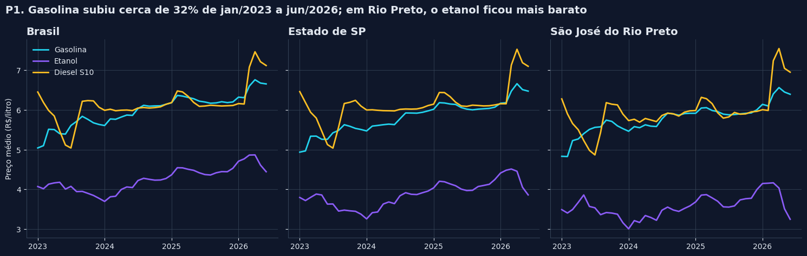
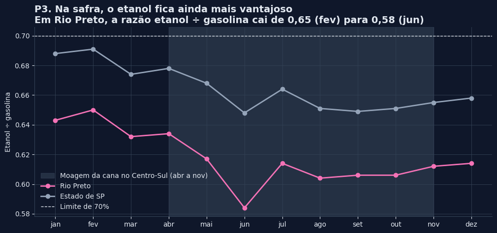
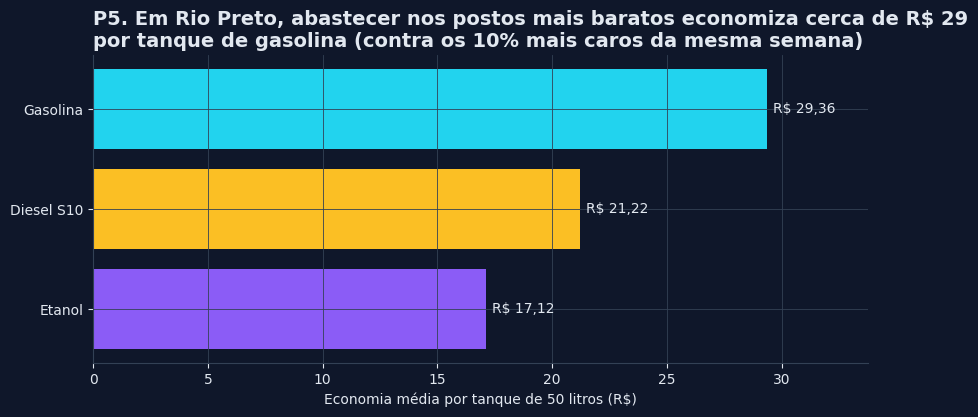

# Preços de combustíveis no Brasil: análise exploratória (ANP, 2023 a 2026)

Análise de 2 milhões de preços coletados pela ANP em postos de todo o país, do 1º semestre de 2023 ao 1º semestre de 2026. Usei Python (Pandas) e SQL (SQLite) para limpar os dados e responder 6 perguntas sobre preço, concorrência e economia, com foco em São José do Rio Preto e no noroeste paulista.

[](https://colab.research.google.com/github/HarleylimaDados/analise-precos-combustiveis-anp/blob/main/analise_precos_combustiveis_anp.ipynb)



## Perguntas

| # | Pergunta | Feita em |
|---|---|---|
| P1 | Como evoluíram os preços de gasolina, etanol e diesel no Brasil, em SP e em Rio Preto? | Pandas |
| P2 | Quais estados têm a gasolina e o etanol mais caros e mais baratos? | SQL |
| P3 | Quando compensa abastecer com etanol (regra dos 70%)? | SQL |
| P4 | Postos com bandeira cobram mais que os de bandeira branca? Quanto? | SQL |
| P5 | Em Rio Preto, quanto o motorista economiza escolhendo o posto? | Pandas |
| P6 | Rio Preto é cara ou barata em relação às cidades vizinhas e à média de SP? | Pandas |

## Resultados

- A gasolina subiu cerca de 32% no período (no Brasil, de R$ 5,04 para R$ 6,66). Diesel S10 e etanol subiram perto de 10%.
- Entre os estados, o preço do etanol varia o dobro do da gasolina (37% contra 18%). SP tem o etanol mais barato do país.
- Em Rio Preto, o etanol ficou abaixo de 70% do preço da gasolina em 39 dos 42 meses. De junho a dezembro, na safra da cana, fica perto de 60%.
- Na mesma cidade e semana, os postos das 3 grandes bandeiras cobram de 13 a 17 centavos a mais por litro que os de bandeira branca.
- Em Rio Preto, os postos mais baratos cobram 59 centavos a menos por litro de gasolina que os mais caros, cerca de R$ 29 por tanque de 50 litros. Pesquisar o posto pesa mais que escolher a bandeira.
- Entre 11 cidades da região, Rio Preto tem o 2º etanol e a 3ª gasolina mais baratos.





As recomendações para o consumidor e para o dono de posto estão no fim do notebook. Os gráficos de todas as perguntas estão na pasta [imagens](imagens).

## Dados e limpeza

Fonte: [Série Histórica de Preços de Combustíveis, ANP](https://www.gov.br/anp/pt-br/centrais-de-conteudo/dados-abertos/serie-historica-de-precos-de-combustiveis). O notebook baixa os 7 arquivos semestrais direto do site, por isso não há dados no repositório.

A base bruta tem 3.038.685 linhas e terminou com 2.010.733. As principais decisões:

- 9.114 linhas totalmente vazias removidas (vieram no arquivo do 1º semestre de 2025).
- Coluna Valor de Compra descartada: estava 100% vazia em todos os semestres.
- CNPJ padronizado com 14 dígitos (no 2º semestre de 2025 veio como número, sem os zeros à esquerda).
- Só gasolina comum, etanol e diesel S10.
- 58 nomes de bandeira agrupados em 5 grupos.
- 12 coletas duplicadas e 897 preços fora do contexto removidos (abaixo de 50% ou acima de 150% da mediana do mesmo produto, estado e mês).

A tabela com todas as decisões está na seção 3 do notebook.

## Como rodar

O jeito mais simples é abrir no Colab pelo botão lá em cima e usar **Ambiente de execução > Executar tudo**. O download dos dados leva alguns minutos.

Para rodar no computador:

```bash
pip install -r requirements.txt jupyter
jupyter notebook analise_precos_combustiveis_anp.ipynb
```

A base limpa é salva em `dados/precos_limpos.parquet`, pasta que fica fora do Git.

## Estrutura

```
├── analise_precos_combustiveis_anp.ipynb   # dados, limpeza, perguntas e conclusões
├── imagens/                                # gráficos das 6 perguntas
├── requirements.txt
└── README.md
```

## Autoria

Projeto feito por Harley Lima. Usei IA (Claude) como apoio para tirar dúvidas de Python e SQL, revisar o código e ajudar a montar parte das análises e dos textos.

Contato: [LinkedIn](https://www.linkedin.com/in/harley-lima-b195a5329/) · harleylima25@gmail.com
